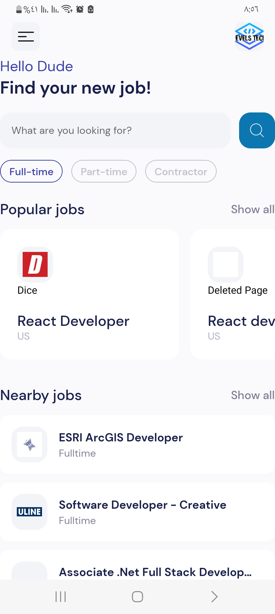
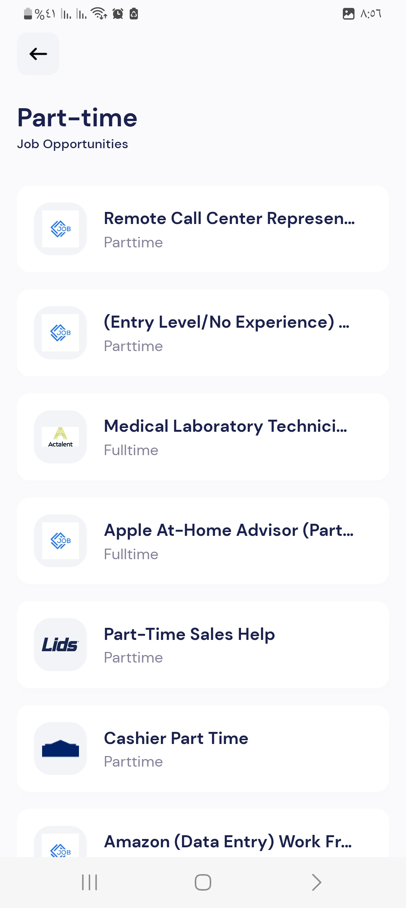

# Jobbative

A basic job-listing application aggregates diverse job opportunities from various APIs, offering a centralized platform for users to explore employment options across multiple sources.

Leveraging the versatility of React Native, users can enjoy a seamless cross-platform experience while taking advantage of the application's user-friendly interface and robust features for efficient job exploration.

## Screenshots (taken on Android)

    
    
    

## How to test
